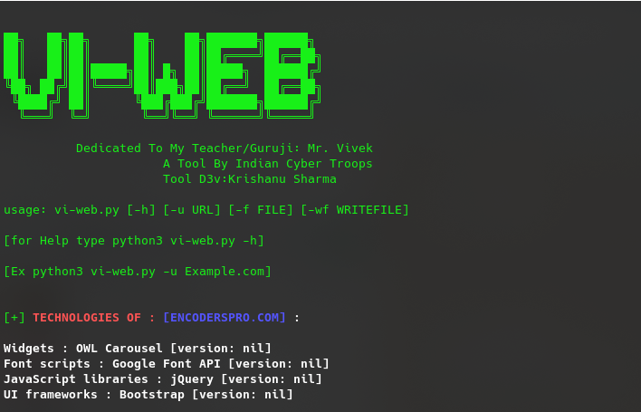

# vi-web
An CLI tool to find Web Technologies Direct In Terminal 
It identifies technologies on websites, such as CMS, web frameworks, ecommerce platforms, JavaScript libraries, analytics tools 
A long list of regular expressions is used to identify technologies on web pages. It inspects HTML code, as well as JavaScript variables, response headers and more to provide you effective results 

## Designed By : K. Sharma
<p>
 <a href="https://www.youtube.com/c/indiancybertroops">
    
  </a>
    <a href="https://instagram.com/indiancybertroops">
    
  </a>
     <a href="https://t.me/indiancybertroops">
    
  </a>

</p>
   
   

## Instruction
read all commands carefully and install requirements file first

### Team Indian Cyber Troops:
>Created By : Krishanu Sharma 

# Features:
>Easy to Install

>Easy to Use

>Designed In Python3

>Easy To Execue

>Fastest (Based On Internet Speed)

>Low Bandwith/Data Consume

>To Find Technologies And Version [Easy Recon Purpose]

>Without Brutforce(To save your valuable Time)
# Main Vi-Web Image

# Installation :
> clone via git clone

```
git clone https://github.com/indiancybertroops/vi-web
```
```
cd vi-web
```
```
chmod +777 *
```
```
pip install -r requirements.txt
```
```
python3 vi-web.py
```


# Github Status
[](https://github.com/indiancybertroops "Stats")<br>

## Contact Us: 


>Instagram
https://instagram.com/krishanuIND
>Instagram
https://instagram.com/Indiancybertroops


>Twitter
https://twitter.com/krishanuIND


>Github
https://github.com/indiancybertroops

## WARNING : 
***This tool is only for educational purpose. If you use this tool for other purposes except education we will not be responsible in such cases. We Are Not Responsible For Damage Caused By Tool***

[!] legal disclaimer: Usage of vi-web for attacking targets without prior mutual consent is illegal. It is the end user's responsibility to obey all applicable local, state and federal laws. Developers assume no liability and are not responsible for any misuse or damage caused by this program
